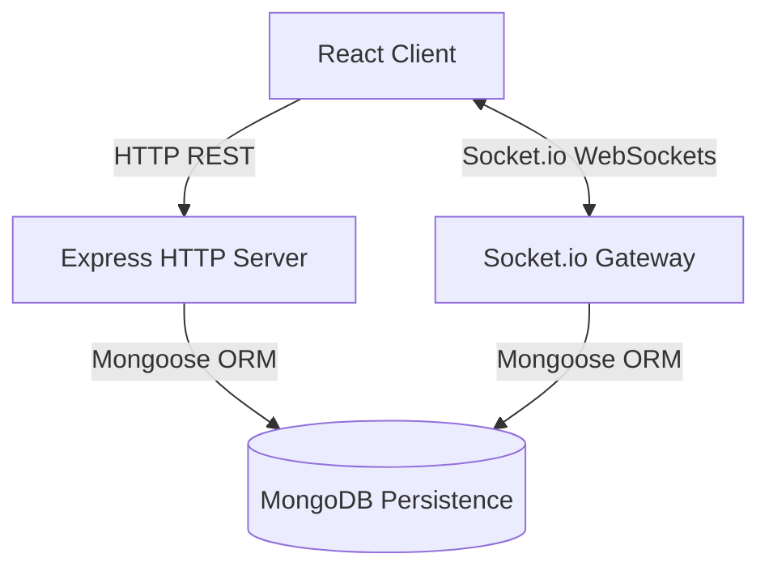

# Chirp 🐥

A real-time messaging web application featuring structured message syncing, media sharing, and presence tracking. Built with a full-stack architecture powered by **React 19**, **Tailwind CSS v4**, **Node.js/Express**, **Socket.io**, and **MongoDB**.

---

## 🏗️ System Architecture

Chirp is built on a decoupled, state-synchronized client-server model:



---

## 🧩 Application Components

### Frontend Components (React Client)

- **Application Shell**:
  Manages the core page layout, authentication states, global Socket.io hooks, state routing, and active overlay modal states.

- **Conversation Directory**:
  Represents the left sidebar panel. It handles:
  - Displaying all active user contacts and recent chats.
  - Active search querying to filter user directories.
  - User presence status computations (online indicators and relative idle time indicators).
  - Draggable split-pane window resizing for user convenience.
  - Triggers for user profiles editing and session sign-outs.

- **Messaging Workspace**:
  Represents the main chat interface on the right. It manages:
  - Displaying individual conversation headers and message streams.
  - Distinguishing incoming messages from outgoing messages.
  - Displaying optimistic placeholders for outgoing messages.
  - Message input interfaces and multimedia file selection.

- **Profile Customizer**:
  An overlay screen enabling users to set up their username, display name, status bio, and upload custom avatars (converting images into lightweight Base64 data strings).

- **Google Authenticator Button**:
  Wraps Google Identity Services to handle OAuth2 authentication and transmit validation tokens to the backend.

---

### Backend Components (Express/Node Server)

- **Stateless HTTP Handlers (REST Controllers)**:
  - **Auth Controller**: Validates Google OAuth2 authentication credentials, registers new accounts, and signs local JWT tokens.
  - **User Controller**: Handles retrieval of profile details, onboarding setup, custom profile modifications, and directory database searches.
  - **Chat Controller**: Configures individual chat channels between participants, including self-conversations.
  - **Message Controller**: Coordinates text message creation, historical logs recovery, soft-deletion overrides, and media attachment streams.

- **Stateful Event Handlers (Socket.io Gateway)**:
  - Intercepts connection events and verifies JWT authentication handshake credentials.
  - Updates and broadcasts user presence flags (online/offline) in real-time.
  - Directs websocket channels by letting clients subscribe to or leave specific chat room streams.
  - Listens to incoming websocket triggers, persists payloads, and broadcasts messages to active room subscribers.

---

## 🔌 Protocols & Event Routing (Which Protocol Does What)

Chirp uses a dual-protocol networking pipeline (HTTP and WebSockets) to balance data integrity with low latency.

```
       [ React Client ]
        /            \
       /              \
  (HTTP / REST)   (WebSockets)
     /                  \
   Stateful Actions,    Low-Latency Updates,
   Data Operations      Presence, Messaging
     /                  \
[ Express Server ]   [ Socket.io Gateway ]
```

### 1. HTTP / REST Protocol
Used for **stateless transactions**, configurations, credentials verification, and large media streams:

| Action Category | HTTP Method & Path | Description |
| :--- | :--- | :--- |
| **Authentication** | `POST /api/auth/google` | Transmits Google OAuth tokens to the server for JWT creation. |
| **User Directory** | `GET /api/users/me` <br> `GET /api/users` <br> `GET /api/users/search` | Fetches active user session, user list, and fuzzy search queries. |
| **Profile Configuration**| `POST /api/users/complete-profile` <br> `PUT /api/users/profile` | Handles profile initialization and updates. |
| **Chat Management** | `GET /api/chats` <br> `POST /api/chats` | Retrieves existing chats or initiates new conversation channels. |
| **Message Retrieval** | `GET /api/message/:chatId` | Retrieves chronological historical message logs for a chat room. |
| **Message Submission** | `POST /api/message/:chatId` | Submits standard text message payloads. |
| **Message Deletion** | `DELETE /api/message/:chatId/:messageId` | Triggers soft-deletion updates. |
| **Media Attachments** | `POST /api/message/:chatId/file` <br> `GET /api/message/file/:id` | Uploads files to database storage streams and serves them to client views. |

### 2. WebSockets (Socket.io) Protocol
Used for **stateful, bi-directional, real-time events** where latency is critical:

| Event Name | Direction | Protocol Role |
| :--- | :--- | :--- |
| `connection` | Client $\rightarrow$ Server | Initiates session, verifies JWT authentication handshake, and sets status to online. |
| `join_chat` | Client $\rightarrow$ Server | Subscribes the client's socket session to a specific chat room channel. |
| `leave_chat` | Client $\rightarrow$ Server | Unsubscribes the client's socket session from a chat room channel. |
| `send_message` | Client $\rightarrow$ Server | Sends real-time messages directly over the socket stream for database persistence. |
| `new_message` | Server $\rightarrow$ Client | Broadcasts newly received text or media messages to all active channel subscribers. |
| `presence_update` | Server $\rightarrow$ Client | Broadcasts real-time availability states (online status and last-active times) to all users. |
| `disconnect` | Client $\rightarrow$ Server | Terminates session, marks user offline, and updates last-seen timestamps. |

---

## 🛠️ Operational Design (What We Do)

- **Real-Time Presence Tracking**: Real-time user statuses are mapped dynamically. Sockets track connection states, turning a green presence badge on for active users, and showing calculated relative durations (e.g., "active now", "5m ago", "2d ago") for offline users.
- **Optimistic UI Synchronization**: The client displays outgoing messages immediately by assigning temporary client-side IDs. Once the server confirms database persistence, the client matches the IDs to transition from pending to sent status.
- **WebSocket Event Deduplication**: The server implements time-windowed deduplication checks to restrict messages from being broadcasted multiple times, preventing race conditions and duplicated message bubbles.
- **Large File Streaming & Expiration**: The backend handles attachments up to 350MB. Video attachments are indexed with automatic expiration rules, purging the documents from the database after 24 hours to prevent storage bloat.

---

## ⚙️ Setup & Installation

### 1. Server Configuration
Navigate to the server directory:
```bash
cd server
npm install
```
Create a `.env` file in the `server/` directory:
```env
PORT=5000
MONGO_URI=mongodb+srv://<username>:<password>@cluster.mongodb.net/Chirp
JWT_SECRET=your_jwt_secret_key
GOOGLE_CLIENT_ID=your_google_oauth_client_id
ALLOWED_ORIGINS=http://localhost:5173
```
Start the backend server:
```bash
npm run dev
```

### 2. Client Configuration
Navigate to the client directory:
```bash
cd ../client
npm install
```
Create a `.env` file in the `client/` directory:
```env
VITE_GOOGLE_CLIENT_ID=your_google_oauth_client_id
VITE_API_URL=http://localhost:5000
VITE_SOCKET_URL=http://localhost:5000
```
Start the frontend application:
```bash
npm run dev
```
Open [http://localhost:5173](http://localhost:5173) in your browser.
